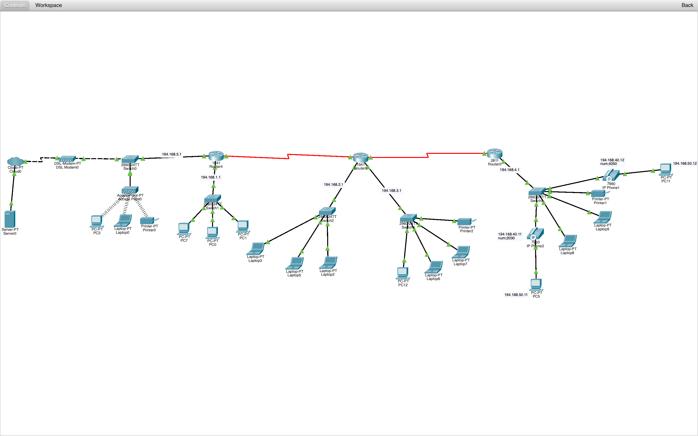
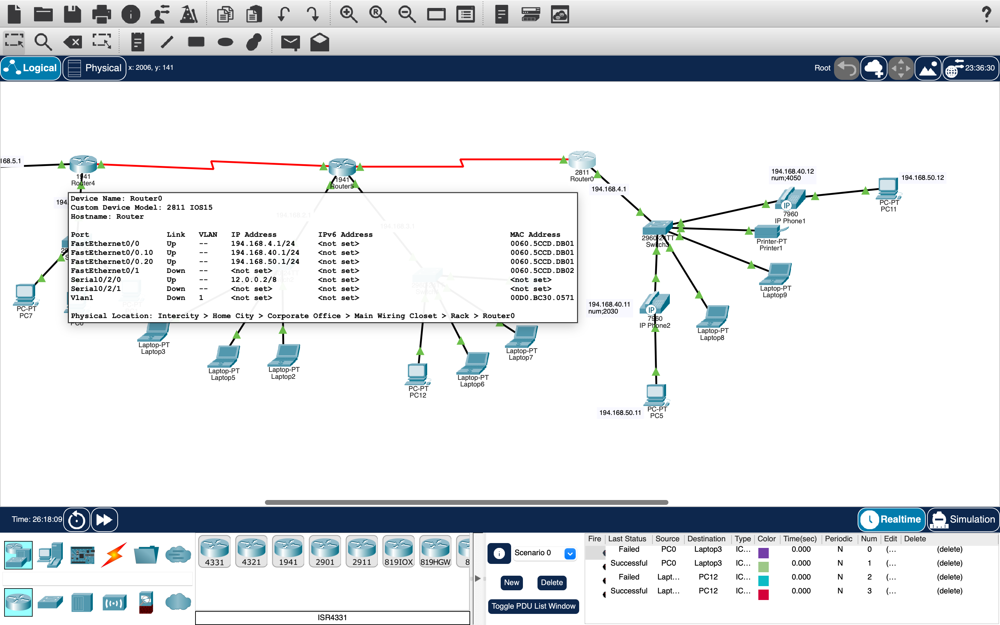
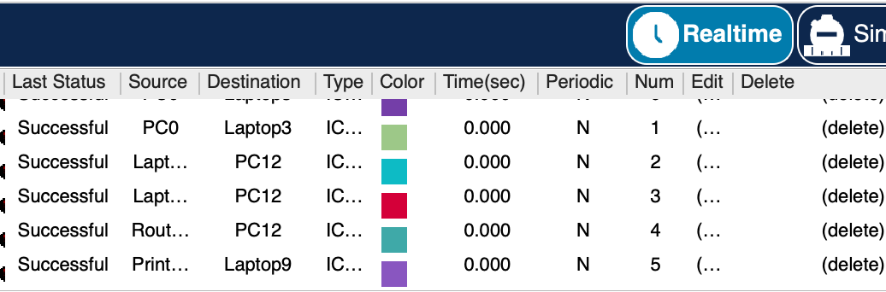

# Enterprise Multi-Subnet Network Design – Cisco Packet Tracer

## Project Overview
This project demonstrates the design and implementation of a multi-subnet enterprise network using Cisco Packet Tracer.

The network includes multiple routers, switches, and end devices distributed across different LAN segments.

## Network Configuration
- Configured Cisco 1941 and 2811 routers
- Assigned IP addresses across multiple subnets (e.g., 194.168.2.0/24, 194.168.3.0/24, 194.168.40.0/24)
- Configured GigabitEthernet and Serial interfaces
- Connected multiple switches and end devices
- Verified inter-network connectivity using ICMP (ping testing)

## Topology

## Router Configuration

## Ping Test (ICMP Verification)

---
*This project was developed as part of a university networking course.*
